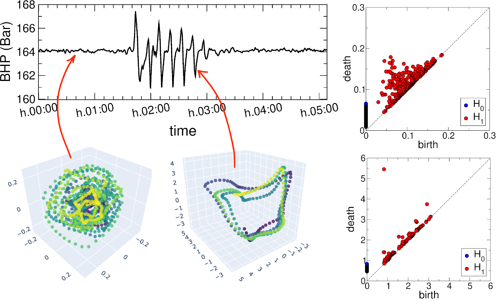
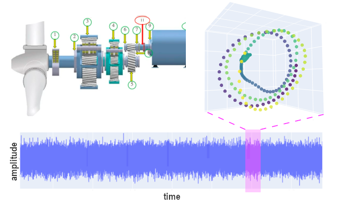

Welcome to my webpage. I specialize in applying data science and machine learning to heavy industries 
such as process, energy and chemicals where dealing with complex and messy sensor data is a challenge. 
In particular, I have a keen interest in topological and geometrical methods.  
Here are some highlights of use cases for real-world challenges in heavy asset industries, 
focusing on enhancing efficiency, safety, and sustainability.    

# Selected Projects and Publications: 
---

## Topological Data Analysis of Slug Flow in Offshore Wells
In this project, [TDA](https://en.wikipedia.org/wiki/Topological_data_analysis) ([persistent homology](https://en.wikipedia.org/wiki/Persistent_homology)) was used to perform signal analysis on offshore sensors data and condition monitoring of the multiphase flow. The undesired transition from regular to severe slugging flow is identified and classified with machine learning.  
The article was published in [Digital Chemical Engineering, Vol.4, page 100045 (2022)](https://www.sciencedirect.com/science/article/pii/S2772508122000357) but there are a few typos in the formulae.  
A corrected version of the article can be found [at this link](/pdf/TDA_for_Slugs_Article_fixed.pdf).

 

---
## Topological Data Analysis for Condition Monitoring of Wind Turbines

Condition monitoring and predictive maintenance are crucial in data science as they help prevent equipment failures
and reduce downtime, leading to significant cost savings and increased efficiency. 
In this project, [TDA](https://en.wikipedia.org/wiki/Topological_data_analysis) 
was applied alongside more traditional (Fourier)
signal analysis, to condition-based monitoring (CBM) of wind turbines for energy generation. 
The investigation focused on identifying early signatures of gear-tooth and ball-bearing failures by means of extracting meaningful
information from complex datasets by analyzing their structure in state space and computing their underlying topological features. 
Data was acquired from a wind park in Norway using standard vibration sensors at different locations on the turbine's gearbox, 
recording vibration acceleration data and its frequency spectra at infrequent intervals for a few seconds at high frequency.  
Topological methods were used to analyze the
shape of the point cloud from vibration time series and generate topology-based key health indicators based on Betti numbers, 
information entropy, and signal persistence.  
These indicators were tested for CBM and fault detection, successfully identifying and classifying faults in wind turbines.  
This work was presented at the 8th European Conference of the Prognostics and Health Management Society [PHM-Europe 2024](https://phm-europe.org/) and 
a full-text paper is available on the [ArXiv at this link](https://arxiv.org/abs/2406.16380).

 

---
## Hybrid Approaches to Virtual Flow Metering  
Multiphase flow can be simulated and predicted in case sensor data are not available. While this could be done via either physical simulators 
or data-driven machine learning models, hybrid approaches provide a more versatile approach especially when coupled with cloud architectures and 
contextualised live data. 
This particular use case was dealing with wells at the end of their lifecycle when water cuts are high and accurate oil rates become economically 
more important.  
This was published in [Digital Chemical Engineering, Vol.9, page 100124 (2023)](https://www.sciencedirect.com/science/article/pii/S277250812300042X)

---
## Gas-Surface Interaction in Materials: Hydrogen dynamics
In my academic days, I have worked at simulating the interaction between gas molecules and material surfaces.
In particular, I worked on the dynamics of hydrogen on [graphene](https://en.wikipedia.org/wiki/Graphene) and graphite surfaces. 
Most of my work on this matter is [summarized in a chapter](https://link.springer.com/chapter/10.1007/978-3-642-32955-5_7) part of this book.  
Other studies were published in international scientific journals. You can find the whole list at my Google Scholar [page](https://scholar.google.no/citations?user=l9E9Zs4AAAAJ&hl=en). 

### Category Name 2

- [Project 1 Title](http://example.com/)
- [Project 2 Title](http://example.com/)
- [Project 3 Title](http://example.com/)
- [Project 4 Title](http://example.com/)
- [Project 5 Title](http://example.com/)

---

---

Page template forked from <a href="https://github.com/evanca/quick-portfolio">evanca</a>

<!-- Remove above link if you don't want to attibute -->
