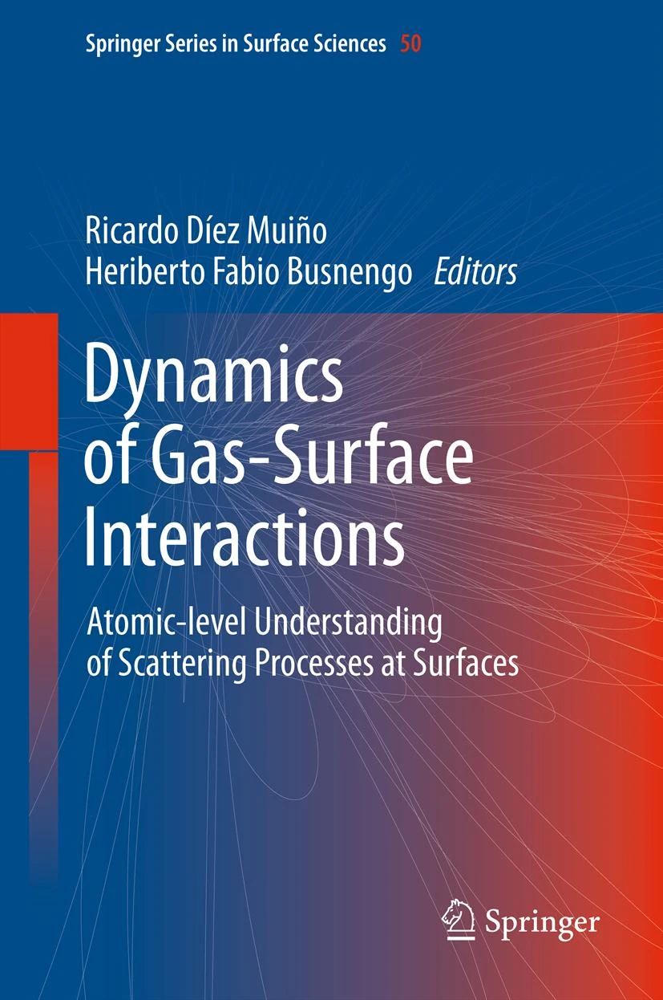

## Portfolio

---

### Selected Projects and Publications: 
## Topological Data Analysis of Slug Flow in Offshore Wells
In this project, [TDA](https://en.wikipedia.org/wiki/Topological_data_analysis) ([persistent homology](https://en.wikipedia.org/wiki/Persistent_homology)) was used to perform signal analysis on offshore sensors data and condition monitoring of the multiphase flow. The undesired transition from regular to severe slugging flow is identified and classified with machine learning.  
The article was published in [Digital Chemical Engineering, Vol.4, page 100045 (2022)](https://www.sciencedirect.com/science/article/pii/S2772508122000357) but there are a few typos in the formulae.  
A corrected version of the article can be found [at this link](/pdf/TDA_for_Slugs_Article_fixed.pdf).

 

---
## Hybrid Approaches to Virtual Flow Metering  
Multiphase flow can be simulated and predicted in case sensor data are not available. While this could be done via either physical simulators 
or data-driven machine learning models, hybrid approaches provide a more versatile approach especially when coupled with cloud architectures.  
In progress.

---
## Gas-Surface Interaction in Materials: Hydrogen dynamics
In my academic days, I have worked at simulating the interaction between gas molecules and material surfaces.
In particular, I worked on graphene and hydrogen. 
Most of my work on this matter, is summarized in a chapter par of the book below:  

 

---
## Condition Monitoring of Wind Turbine Data
Several data science methods are used to predict failures in wind turbines for energy generation. 
In progress.

---
[Project 3 Title](http://example.com/)

---

### Category Name 2

- [Project 1 Title](http://example.com/)
- [Project 2 Title](http://example.com/)
- [Project 3 Title](http://example.com/)
- [Project 4 Title](http://example.com/)
- [Project 5 Title](http://example.com/)

---

---

Page template forked from <a href="https://github.com/evanca/quick-portfolio">evanca</a>

<!-- Remove above link if you don't want to attibute -->
